# Shortest Delivery Path with Reinforcement Learning

> This is a semester-long assignment completed by four people: Michelle Adeline, Pay Quan Bi, Chan Jia Zheng, and Zoe Low Pei Ee. **The final grade for this assignment is HD (96/100)**


<p style="text-align:center;">
    Random Agent Path at Episode 1 (following greedy policy)&nbsp;&nbsp;
    <span style="float:center;">
        Random Agent Path at Episode 1000 (following greedy policy)
    </span>
</p>

<center>
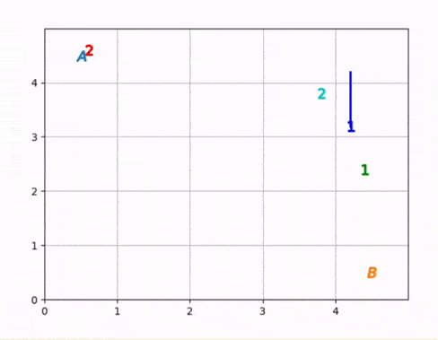
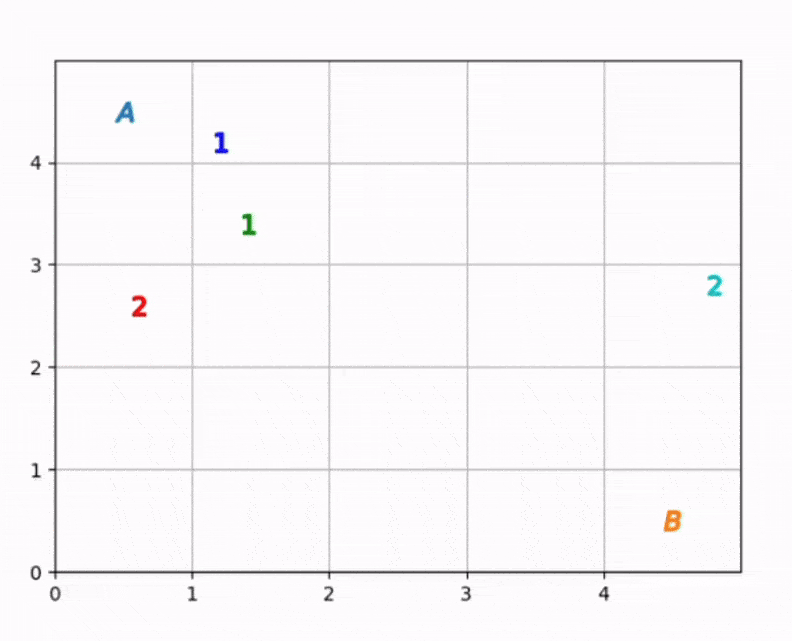
</center>

## Task Description

4 agents must learn to navigate the grid world. 

Two agents are type I agents which are responsible for:
1. navigating to location A (and thus automatically picking up the item there)
2. handing over the item to a type II agent (by meeting with such an agent in a particular grid cell)


The other two agents are type II agents which are responsible for:
1. receiving an item from a type I agent (by meeting with such an agent in a particular grid cell)
2. navigating to location B with the item (and thus delivering the item to B)

Each agent can only carry one item at a time. 

Locations A and B are fixed to the top-left corner of the grid world (`[0,0]`) and the bottom-right corner of the grid world (`[gridsize-1, gridsize-1]`) respectively.

The agents must learn to do their tasks regardless of where they are spawned in the grid world as the agent locations are randomized at the start of each episode.


> Note: for full details and code snippets, please see the full report [**here**](phase_3_full.ipynb)

### Episodes

A learning episode is finished if either condition is satisfied:
- all agents' individual episodes are completed, or
- the maximum step count (10,000) has been exceeded.

Each agent's individual episode ends once they have completed their responsibilities:
- For type I agents, their episode ends after handing over the item to a type II agent. 
- For type II agents, their episode ends after navigating to location B (with the item). 

After the agent's individual episode ends, they are removed from the grid world and can no longer perform any further actions (because they are done with their tasks).

### State space
We have experimented with two different types of states:

#### `single_relative_target` $\in \mathbb{Z}^2$
This approach is similar to the state we employed for Stage 1 and 2 where we have formulated our state as the (x,y) position relative to the target (A/B/closest other agent). 

Let (u, v) be state.  
Let (x, y) be grid size.  

Based on our implementation:
1. u is the horizontal position of agent with respect to the target (A/B/closest other agent). u ∈ [-(x-1), (x-1)]
2. v is the vertical position of the agent with respect to the target (A/B/closest other agent). v ∈ [-(y-1), (y-1)]
3. Position of target relative to itself is at (0 ,0) 

Target is defined for each agent to be:
-  For Type I agents:
    - (before they pick up the item:) target is location A.
    - (after they pick up the item:) target is the closest type II agent.

- For Type II agents:
    - (before they receive the item:) target is the closest type I agent holding an item (or if none of the type I agents are holding an item, it targets the type I agent closest to this agent)
    - (after they receive the item:) target is location B.

#### `absolute_positions` $\in \mathbb{W}^5$
Let (x, y) be grid size. 
Our state consists of: [pos_x, pos_y, target_x, target_y, has_item], where:
- pos_x: is the absolute x position of the agent (pos_x ∈ [0, x-1])
- pos_y: is the absolute y position of the agent (pos_y ∈ [0, y-1])
- target_x: is the absolute x position of the target (target_x ∈ [0, x-1])
- target_y: is the absolute y position of the target (target_y ∈ [0, y-1])
- has_item: 1 if the agent is holding an item, 0 otherwise.

Target is defined for each agent to be:
- For Type I agents:
    - (before they pick up the item:) target is location A.
    - (after they pick up the item:) target is the closest type II agent.

- For Type II agents:
    - (before they receive the item:) target is the closest type I agent holding an item (or if none of the type I agents are holding an item, it targets the type I agent closest to location A)
        - why the type I agent closest to A? because it stands to reason that such an agent would pick up the item first before the other agent further away from A.
    - (after they receive the item:) target is location B.

### Action space
Our Q-Agent can move in the four cardinal directions -- Up, Down, Left, Right.

However, if it is adjacent to one or more of the four corners of the grid world, then its movements are limited. For example, if it is adjacent to the right corner of the grid world, it cannot move Right (since then it would move off the map!)

Note that the following measure has been taken to implement a scalable solution:
- `Movement` class
    - agents will check for subclasses of `Movement`, thus if we want to add another movement to the task, we can simply inherit `Movement` class and all agents will be able to use this movement without changing the `Agent` code at all!

*Note: the two type I agents receive a reference to a single learning object. The two type II agents also receive a reference to a single learning object, i.e. agents of the same type share the same Deep Q Learning model*

### Reward Structure

Our reward structure can be split into 2 cases:
- **when they reach their target**: the agent receives a TARGET_REWARD for the (state,action) pair which brought them to their target. This TARGET_REWARD is set empirically to 200 based on testing (the value needs to be quite high to counter the quadratic move penalty). On top of this, it receives a penalty for the number of moves the agent took to reach the target from the starting position
    - *(note: if this is the first target that the agent has reached, the starting position is its initial spawn position. If this is the second target the agent has reached, the starting position is the position it was at when it reached the first target)*
- **when they reach a non-target position**: the agent receives a BASE_REWARD of -1. On top of this, to speed up training, we multiply this base reward with an occupancy grid penalty based on the number of times it has visited a particular grid cell. The more it has visited a particular location, the larger the penalty.

As the agent aims to maximize the reward, the TARGET_REWARD and BASE_REWARD are positive and negative respectively to encourage the agent to reach the target in fewer steps. The imposed penalty on the number of moves helps incentivizes the agents to reach their targets in as few steps as possible and the imposed occupancy grid penalty encourages it not to revisit positions it has already visited before, i.e. doubling back to the same positions. This is based on the concept that a shortest path between two points should not have repeated nodes.

*Note: due to random generation of the agent locations and the fact that each agent has 2 targets, sometimes the shortest path to the second target necessitates retracking part of the same path taken to reach the first target, thus we have seperate occupancy grids associated with each target.*

Implementation detail:
- the move number penalty is made possible by recording the move number at which each agent reaches its targets. 
    - For example: [4, 10] means that the agent reaches its first target at move 4 and its second target at move 10. Thus the move penalty when they reach the first target is $4^2$, and for the second target is $(10-4)^2$ (this information is recorded in the `History`)
- the occupancy grid penalty is made possible by recording the occupancy of each grid cell in the environment for each target of each agent (this information is recorded in the `History`)

To further improve the convergence and avoid the agent from locking itself in a loop during evaluation step due to incomplete policy learning, the maximum steps taken by agent per episode is integrated such that the agent would receive large penalty for not reaching the target within maximum number of steps per episode. This will allow the agent to learn the ideal path and ultimately take minimum steps to reach the target. For simplicity, the maximum steps is chosen to be double of the number of grids in the environment to accommodate delivering the item to B within a single episode. Importantly, this large penalty is spread out over the (state, action) pairs of the agents for the entire episode to penalize the entire sequence instead of just heavily penalizing the latest (state, action) pair

Overall, the reward function could be summarized in the following equation.

$\forall (s,a) \in S_i \times A_i, \forall i$

```math
    R(s, a) = \begin{cases}
        \text{TARGET\_REWARD} - \text{NUM\_MOVES} ^ 2 & \text{ if the agent is at its target (see Agent section above) } \\
        \text{BASE\_REWARD} \times \text{NUMBER\_OF\_VISITS} & \text{ if the agent is not at its target (see Agent section above) } \\
        -100 / \text{TOTAL\_NUM\_MOVES} & \text{ if maximum steps is reached, penalty is equally spread between all (s, a) pairs }
    \end{cases}
```

where $S_i \times A_i$ is the set of (state, action) pairs performed by agent $i$ during a particular episode, and $\text{NUM\_MOVES}$ is the number of moves taken by the agent since it reached its last target (or its spawn position if it has yet to reach a target during the episode)

## Deep Q-Netwok

A Deep Q-Network (DQN) is a reinforcement learning algorithm that combines deep neural networks with Q-learning, a popular tabular algorithm for solving Markov decision processes. The main idea behind DQN is to use a deep neural network to approximate the Q-values by stochastic gradient descent, which represent the expected future rewards for taking different actions in a given state. The following describes few important elements in Deep Q-Network

### Q-Value Update

In general, the optimal action-value function obeys the Bellman Equation which is based on the following intuition: If the optimal value, $Q^{*}(s', a')$ of the sequence $s'$ at the next time-step was known for all possible actions $a'$, then the optimal strategy is to select the action $a'$ which maximizes the expected value $r + \gamma Q^{*}(s', a')$. Mathematically speaking, we have

```math
    Q^{*}(s, a) = \mathbb{E}_{s' \sim \varepsilon}[r + \gamma \max_{a'} Q^{*}(s', a') \; | \; s, a]
```

Unlike the tabular Q-learning which uses Bellman equation for iterative update such that

```math
    Q_{i+1}(s, a) = \mathbb{E}[r + \gamma \max_{a'} Q_{i}(s', a') \; | \; s, a]
```

DQN with parameters $\theta$ is trained by minimising a sequence of loss function, $L_i(\theta_i)$ which changes at each iteration

```math
    L_i(\theta_i) = \mathbb{E}_{s, a \sim \rho (\cdot)}[(y_i - Q(s, a;\theta_i))^2]
```

where 

```math
    y_i = \mathbb{E}_{s' \sim \varepsilon}[r + \gamma max_{a'} Q(s', a'; \theta_{i-1})\;|\;s, a]
```

is the target for iteration $i$ and $\rho(s, a)$ is a probability distribution over sequences $s$ and actions $a$ that we refer to behaviour distribution. The parameters from the previous iteration $\theta_{i-1}$ are held fixed when optimising the loss function $L_i(\theta_i)$ to emulate fixed target in conventional supervised learning. With that, differentiating the loss function, we obtain an update gradient as follows.

```math
    \mathbb{E}_{s, a \sim \rho (\cdot); s' \sim \varepsilon}[(r + \gamma max_{a'} Q(s', a';\theta_{i-1} - Q(s, a; \theta_i))\Delta_{\theta_i}Q(s, a;\theta_i)]
```

From the above equation, we note that DQN agent updates its Q-network by minimizing the mean squared error between the predicted Q-values and the target Q-values. Note the target Q-values are dependent on the weights of the network weights, resulting in unstable learning at each update. To address the issue, a target network which is a separate network but with the same initialized weights as the network is created and periodically updated to match the weights of the network in order to simulate the effect of policy iteration. In practice the behavioural distribution, $\varepsilon$ is selected to follow $\epsilon$-greedy policy.

### Experience Replay

Instead of conducting the weight updates incrementally for each sample as in Tabular Q-Learning, experience replay is introduced to improve the training stability by reducing correlation between consecutive samples while also allowing a single batch update. 

The idea is simple: batches of states, actions and rewards are randomly sampled from the past experience (that has yet been used) and is used to update the weights of the network. Through random sampling, temporal correlation in the agent's experiences are disrupted and hence agent is exposed to more diverse set of experiences which greatly reduces the bias and variance during learning. On the other hand, sampling from past experiences allows a good trade-off between exploration and exploitation as agent may utilize important experiences which may not necessarily be recent. With that, the training could be stabilized with less dependent relationship between the order of encountered experiences.

### Double Q-Learning Variant

In tabular method, a double q-learning would maintain 2 sets of Q values, namely $Q_1(s, a)$ and $Q_2(s, a)$. The idea is to create an unbiased estimator from the 2 sets of Q values. The update rule would be as follows.

```math
    Q_1(s, a) \leftarrow{} Q_1(s, a) + \alpha (r + \gamma Q_2(s', \arg\max_a Q_1(s', a)) - Q_1(s, a))
```

$$Q_2(s, a) \leftarrow{} Q_2(s, a) + \alpha (r + \gamma Q_1(s', \arg\max_a Q_2(s', a)) - Q_2(s, a))$$

The 2 update rules are interleave with a predefined probability. Transfering the knowledge to Deep Q-Network, we could rewrite the evaluation of DQN target to be

```math
    y_i = \mathbb{E}_{s' \sim \varepsilon}[r + \gamma Q(s', max_{a'} Q(s', a'; \theta_{i-1}); \theta_{i-1})\;|\;s, a]
```

Replacing $y_i$ to the loss gradient function in DQN above, we obtain an update gradient as follows.

```math
    \mathbb{E}_{s, a \sim \rho (\cdot); s' \sim \varepsilon}[(r + \gamma Q(s', max_{a'} Q(s', a';\theta_{i-1}); \theta_{i-1}) - Q(s, a; \theta_i))\Delta_{\theta_i}Q(s, a;\theta_i)]
```

Since we require 2 models, namely target and prediction model, Double DQN could be easily realized by replacing the update rule in existing implementation without any modification on the network structure. However, such simple idea could reduce overoptimism in the estimate of DQN and find a better policy as compared to DQN.

### Multi-Agents System
In order to accommodate the existence of multiple agent types with different behaviours and goals, agents of the same type will share the same DQN. Note that each DQN would use the same update rule and the policy is learnt to match with the agents' goal. That being said, DQN for each type of agent would have different weights for each state and hence providing different best action according to the scenario.

Since there are multiple agents of same type sharing the same DQN, the implementation of experience replay would be adapted to sample the experiences from multiple agents of same type instead of a single agent. Such sampling provides a higher degree of variety and robustness with increasing number of possible combinations in the sampled experiences. This would further enhance the learning by exploring unseen scenarios. Nonetheless, the sampling is still subjected to the limit of replay buffer.

### Implementation

In our implementation, to accommodate the dual network training scheme, we have maintain 2 models, namely prediction and target network which shares the same structure and same weights during initialization. Our model is kept minimally simple with 3 hidden linear layers using ReLU activation function. Following the convention, $\epsilon$-greedy policy is chosen as the behavioral distribution scheme. However, for experimental purpose, the number of layers, type of activation function and behavioral policy could be changed due to the flexible implementation.

Also, note that the above update rule is based on Mean-Squared Error. However, in our implementation, we have chosen SmoothL1Loss, defined as

```math
    L(\hat{y}, y) = \begin{cases}
        \frac{0.5(\hat{y} - y)^2}{\beta} & \text{ if } |\hat{y} - y| < \beta \\
        |\hat{y} - y| - 0.5\beta & \text{ otherwise}
    \end{cases}
```

to be our loss function for updating the weights as we find that it greatly matches with the state representation and results in better training convergence.

In our implementation, instead of sampling from the entirety of the past experiences, we only allow the replay buffer to store the experiences that minimally exceed the batch size for every episodes. This would ensure the efficient use of memory and reduce the time complexity of sampling from numerous experiences. However, this comes with a minor drawback such that the training convergence is slower as compared to using a larger buffer memory. Additionally, `not_done` mask is included in the sampling process due to the modifications in the state representation as described above. With that, we have to cater for (state, action) pairs which leads to the ending position and hence update the Q-value using the correct discount factor accordingly. The target value in the update rule could be formulated as follows.

```math
    \hat{Q}(s_t, a_t;\theta) = \begin{cases}
        r + \gamma \max_{a_{t+1}} \hat{Q}(s_{t+1}, a_{t+1}; \theta) & \text{ if } s_t \text{ is not ending state} \\
        r & \text{ Otherwise}
    \end{cases}
```
where $\hat{Q}$ is the target network, $r$ is the reward at each state $s$

Other than that, instead of maintaining only 1 network as in previous stage, we have to maintain 2 networks for 2 types of agent. `Engine` class has been modified to adapt to such scenario with scalable design using Python list for storing the networks. For further details, please refer to the relevant classes stated below.

## Training & Testing

As described above, class `Engine` is responsible for training and evaluating the agents in recognizing the ideal path to point A, efficient handoff point and point B. On the other hand, supported class, `Loss`, is utilized to evaluate the performance of the agents for a given episode or a sequence of episodes.

Following convention from typical practices in Machine Learning training where batch inference is evaluated on unseen dataset for determining the performance of the agent, after every `n` episodes of training we will freeze updates on the DQN models and perform evaluation of the model.

### Training Procedures
During training, **position of agents are randomly generated for every episode** with location A and location B fixed at the top-left and bottom-right corners of the grid respectively. Actions are suggested by the behavior policy (see Deep Q-Network section above) and used for updating the Deep Q-Network after every episode which would eventually approach the target policy. Every episode would run until the predefined maximum step is reached or all agents have completed their individual episodes (see Episodes section above). Note that once an agent has completed its task, it is deemed inactive and would not be involved in the remaining steps of the episode. Such implementation would help stabilize the training and avoid the occurrence of scenarios wherein an agent that has completed its task is left wandering around aimlessly and thus incurring movement penalties as it has no target. On top of that, the agent would have a clear understanding on its goal throughout the learning in this training scheme as the task of agents are well defined and they are stopped once they accomplish their task. The modifications done for adapting multiple collaborating agents to complete a task is the main difference from the training scheme in previous stage. Another difference of our approach from a standard reinforcement learning is our reward structure (Refer to Reward section above).

Following common practice in Machine Learning training, we keep track of models which result in the lowest evaluation losses, and we generally use the model at this state for further evaluation.


### Evaluation Procedures

During evaluation, we freeze the update of the model and we randomly sample 500 spawn positions for all agents in the grid world and we test the model performance on each of these positions. Our final evaluation loss and reward is then the average over the losses and rewards for each of these scenarios.

Using the loss functions (described below), we can determine whether the agent could perform well on seen and unseen configurations based on learnt q-values.

*Note: due to the fully greedy policy, the target policy only exploits with no chance for exploration, thus on early evaluations it could get stuck going back and forth in a small area, to avoid this going on forever, we set a maximum number of steps (2\*grid size) after which the agent is given a large penalty*


### Metrics

For evaluation purpose, we have defined 2 loss functions, namely L1-Loss and L2-Loss as shown below.

$$L_1(y, \hat{y}) = |\hat{y} - y|$$
$$L_2(y, \hat{y}) = (\hat{y} - y)^2$$

where $\hat{y}$ is the number of steps taken by the agent to reach its target and $y$ is the minimum number of steps taken to reach its target. 

The minimum number of steps taken to reach handoff point is calculated as the L1 distance between the grid positions of Type I and Type II agents at the point in which the Type I agent reaches point A to pick up the item. This number is then divided by 2 to accommodate the fact that both agents could make a move in a single turn, and idealy both would move towards each other. The calculations for point A and point B are simpler as the locations are fixed and non-movable.

The above loss functions serve as an indicator of the learning progress of the agent in finding the ideal path. If the agent is able to find the ideal path, the loss value would eventually converge to 0. The 2 loss functions above are better alternatives than the average rewards as proposed in the lecture since agents' location vary in each episode randomly and hence the average rewards would be affected by random number generator (RNG) in each episode. With that, there are cases where average rewards are high due to short distance between agents, point A and point B if spawn locations happen to be very close to one another and vice versa. To eliminate such ambiguous case, the above 2 loss functions are chosen which are not affected by the random spawns and treats easy and hard scenarios fairly.

# Visualization

## Predicted Q-value Visualization
#### Type I agent with target: Location A
- For `MoveLeft`, q-values are overall high because location A is at [0,0] and thus for most grid cells moving left is the optimal choice, the values are higher when the agent is to the right of location A.
- For `MoveRight`, q-values are low overall except at bottom-left of the grid. However, the values are bested by `MoveUp` and `MoveLeft`. This makes sense since the location A is fixed at [0, 0] thus there is no scenario where the agent should move right.
- For `MoveUp`, q-values are overall very high because location A is at [0,0] and thus for most grid cells moving up is the optimal choice, the q-value is higher when the agent is to the bottom of the target.
- For `MoveDown`, q-values are low overall and bested by `MoveLeft` and `MoveUp`, this makes sense because of the fixed location of A at [0, 0] and thus there is no scenario in which the agent should move down.

Note: for diagonals, the optimal move is either `MoveLeft` followed by `MoveUp` or vice versa as location A is fixed at [0, 0]

<center>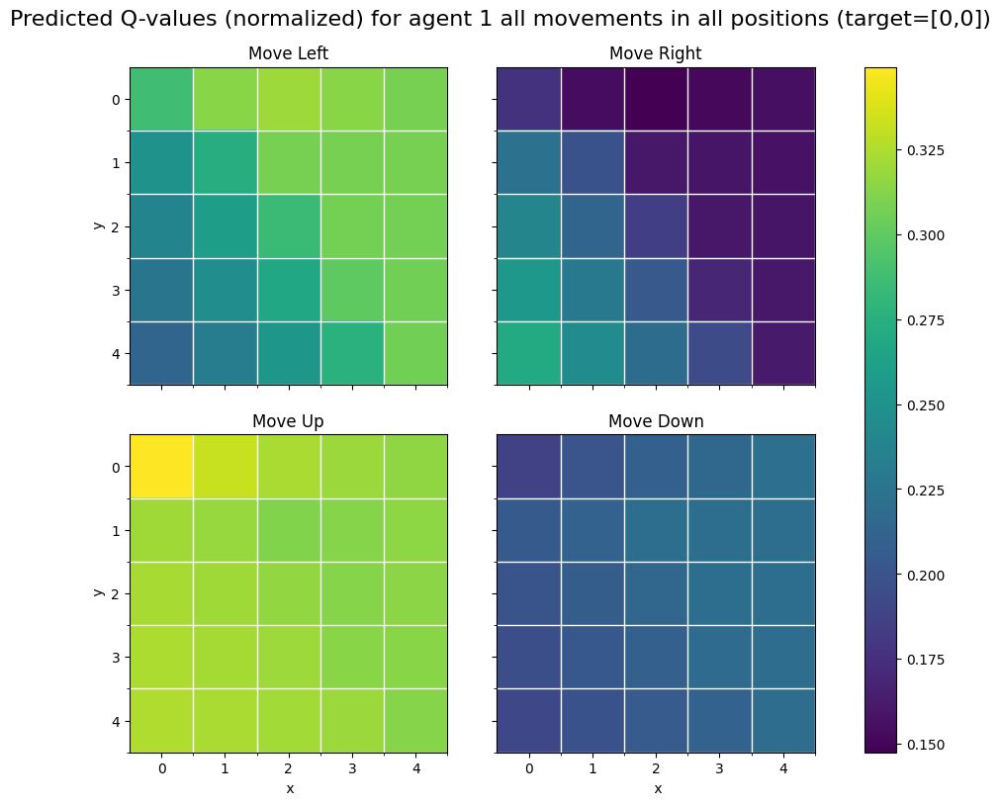</center>


#### Type I agent with target: Type II agent at [1, 3]
- For `MoveLeft`, q-values are low and bested by `MoveRight` and `MoveDown` in all scenarios.
- For `MoveRight`, q-values are high overall and this action is executed most of the times.
- For `MoveUp`, q-values are low and bested by `MoveRight` and `MoveDown` in all scenarios.
- For `MoveDown`, q-values are high overall but bested by `MoveRight` in all positions. This action is executed when `MoveRight` is not a possible move due to grid boundaries.

Note: for diagonals, the optimal move is either `MoveRight` followed by `MoveDown` or vice versa as Type I agent aims at Type II agent only after it reaches location A [0, 0]. Hence, Type II agent is always on the right or bottom of Type I agent. This also explains the above observation of high q-values for `MoveRight` and `MoveDown` actions. However, **it is noted that the policy is not learnt to direct the agent to the target location, i.e. [1, 3] but to the efficient handoff point since Type II agent is moving at the same time**. As such, we notice the efficient handoff point learnt by Type I agent is always on the bottom-right region in the grid.

<center>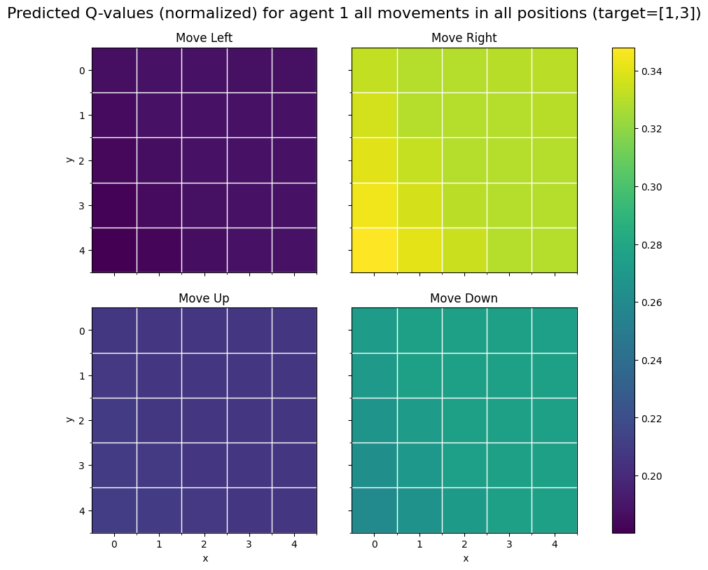</center>

#### Type II agent target: Type I agent at [0, 0]
- For `MoveLeft`, q-values are high and only bested by `MoveUp` at bottom-right region of the grid.
- For `MoveRight`, q-values are low overall and this action is executed only when agent is at top-left corner of the grid.
- For `MoveUp`, q-values are high at bottom-right region of the grid.
- For `MoveDown`, q-values are low and bested by all other actions at all scenarios.

Note: for diagonals, the optimal move is either `MoveLeft` followed by `MoveUp` or vice versa as Type II agent aims at Type I agent at [0, 0]. This also explains the above observation of high q-values for `MoveLeft` and `MoveUp` actions. However, it is noted that the policy is not learnt to direct the agent to the target location, i.e. [0, 0] but to the efficient handoff point since Type I agent is moving at the same time. As such, we notice the efficient handoff point learnt by Type II agent is always on the top-left region in the grid. Moreover, we note that the learnt policy is matched with that of Type I agent. **This shows that the agents are meeting at efficiently chosen handoff point rather than random places.**

<center>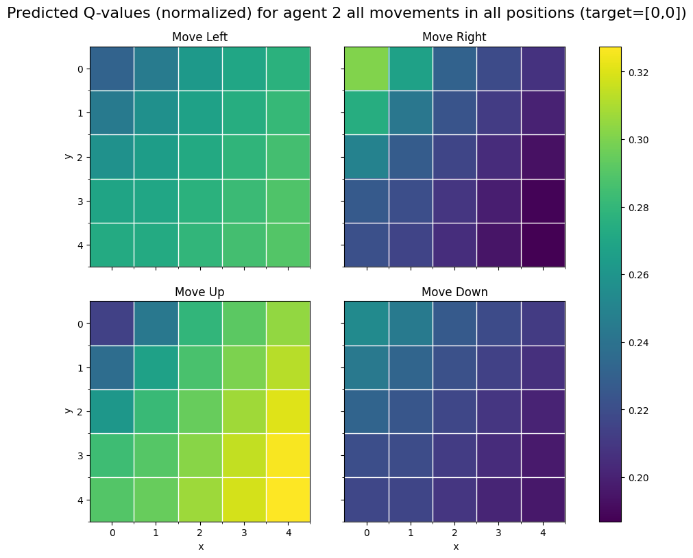</center>

#### Type II agent target: Location B
- For `MoveLeft`, q-values are low and bested by `MoveRight` and `MoveDown` in all scenarios.
- For `MoveRight`, q-values are high overall and this action is executed most of the times.
- For `MoveUp`, q-values are low and bested by `MoveRight` and `MoveDown` in all scenarios.
- For `MoveDown`, q-values are high overall but bested by `MoveRight` in all positions. This action is executed when `MoveRight` is not a possible move due to grid boundaries.

Note: for diagonals, the optimal move is either `MoveRight` followed by `MoveDown` or vice versa as Type II agent aims at a fixed location B at the bottom-right corner of the grid. Hence, the target is always on the bottom-right of Type II agent. This also explains the above observation of high q-values for `MoveRight` and `MoveDown` actions.

<center>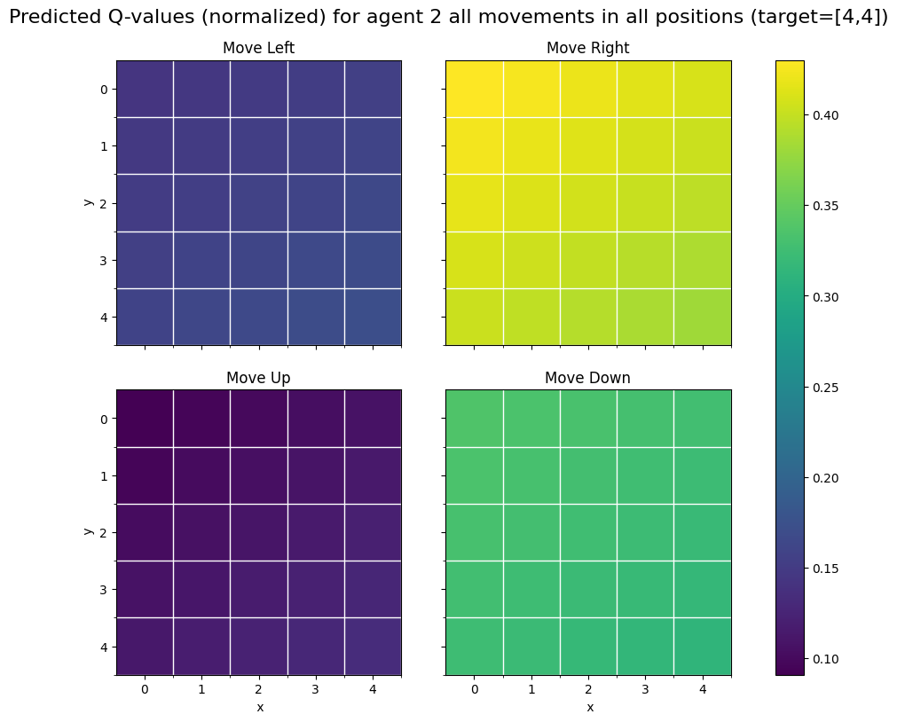</center>

## Policy Visualization
To visualize the policy, for a particular episode, we plot only the direction (action) with the highest q-value, $Q(s, a)$, learnt by the model so far, given the state. With this we can get a comprehensive overview of the best actions for each possible state. 

Note that due to the changing locations of agents, the policy would vary for different configurations.

Regardless as you can see from the plots below, for every grid cell, the best suggested action will always bring the agent closer to the target for both location A and B as described in the heatmap above, showing not only that our model has clearly learnt the task very well but also that it has sufficiently explored all the states when their targets are static.

However, when the target is not a fixed position like location A and B but a movable agent, we use a random position as the target. For these dynamic targets, we note that the policy learnt by the agent would not be targetting to the target but rather heading to the nearest handoff point which matches the policy of the target agent. Based on the learnt policy, we note that the learning is still not yet completed and more states should be explored to stabilize and solidify the policy.

<center>

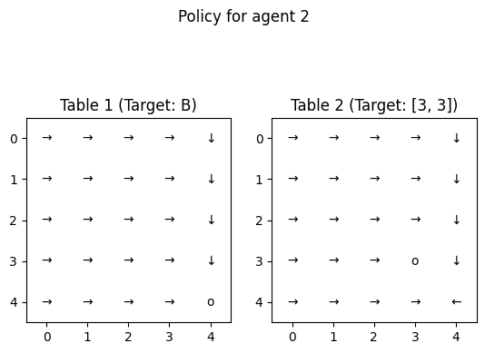
</center>

## State & Q-Values Visualization

#### Type I agent with target: Location A

From the visualisation below, as expected, the most important position is [0,0] which is the target itself and its directly adjacent positions [0,1] and [1,0] which are only 1 move away from the target. This clearly shows that the type I agent has learned very well and heads to the top-left corner to pick up the item at location A.

Consequently the positions that are far away from [0,0] such as the far right or far bottom of the grid has the lowest Q-values as many moves are required to reach [0,0] from those positions.

<center>
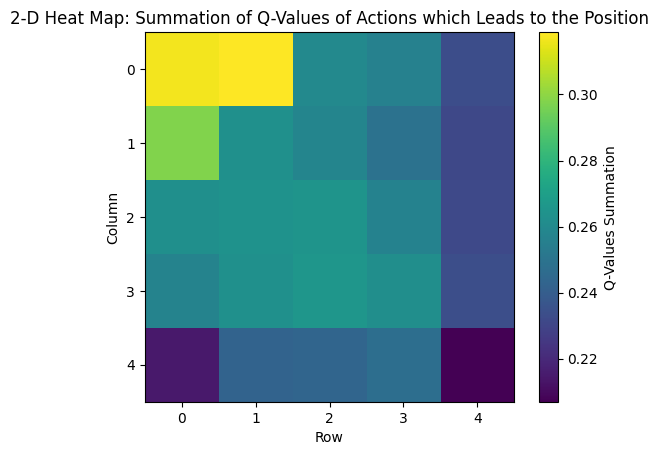
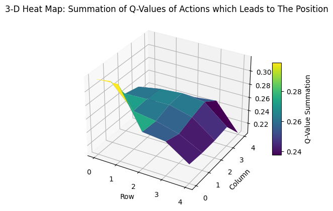
</center>

#### Type I agent with target: Type II agent at [2, 1]

From the visualisation below, we notice that the adjacent grids to the position [1, 1] and [2, 0] have particularly high Q-values. In particular we note that [2,1] itself does not have a very high Q-value which again reinforces the idea that instead of targetting the current position of the type II agent, since the target is dynamic, we expect it to move, and thus the model actually prioritizes moving towards an efficient handover point **between** its current location and its dynamic targets present location. [3, 1] has a lower Q-value compared to [1,1] and [2,0] because after the Type I agent picks up the item, it should be at A ([0,0]) and thus, the ideal handover point should be between [0,0] and [2, 1].

*Note that although [4,4] has a very high Q-value during training type I agents rarely actually reach [4,4] and this is more of an indication that the model favours moving right compared to left (notice that the entire first column has very low Q-values).*

<center>
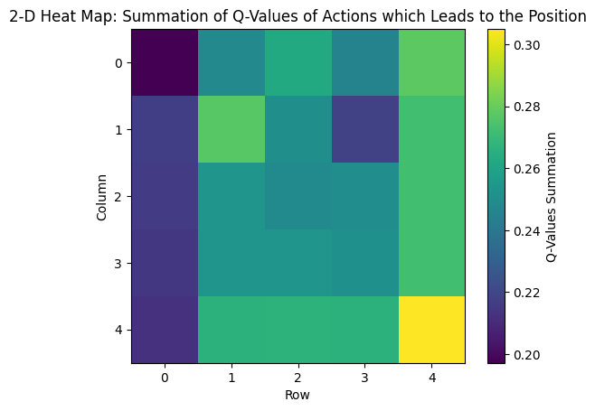
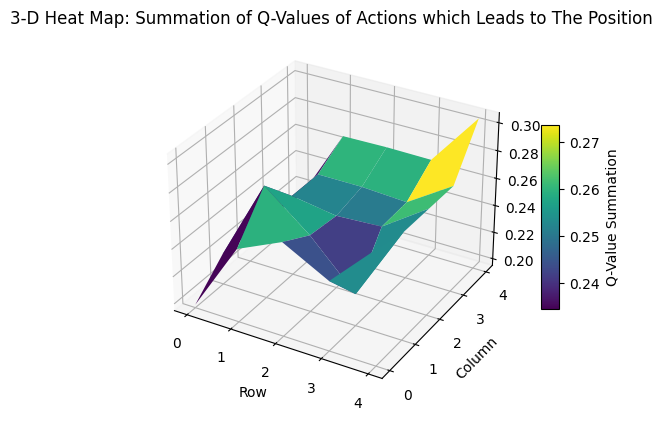
</center>

#### Type II agent with target: Location B

From the visualisation below, as expected, the most important position is [4,4] which is the target itself and its directly adjacent positions [3,4] and [4,3] which are only 1 move away from the target. This clearly shows that the type II agent has learned very well and heads to the bottom-right corner to deliver the item to location B.

Consequently the positions that are far away from [4,4] such as the far left or far top of the grid has the lowest Q-values as many moves are required to reach [4,4] from those positions.

<center>
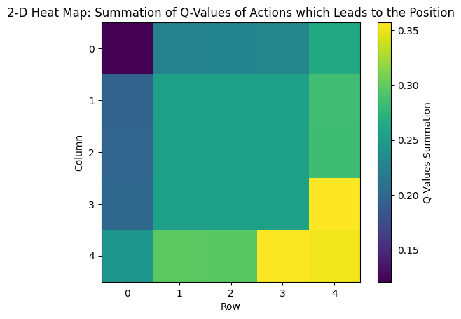
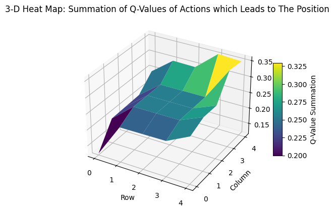
</center>

###  **Loss Graphs (Training)**

To visualize the performance of our model over time, we plot the losses over the number of episodes as a line graph. 
Note: these are the custom L1 and L2 losses (NOT the SmoothL1Loss used for training the Deep Q-Network) which directly assesses model performance in reaching the target via the least number of steps

To improve the instability and low convergence problems in DQN, we also experimented with Dueling DQN (seen as "Dueling" below), see the full report [here](phase_3_full.ipynb) for more info.

Note: the spikes in losses are due to the moving goalpost when weights of prediction network is copied over to target network, importantly you can see that the spikes in losses decrease as training progresses and eventually loss converges to 0, which proves that our model is learning

We note that although the original Deep-Q method had higher average losses in earlier batches, after its loss decreased to 0, regardless of moving goalpost, no more loss spikes were seen showing that it converged stably. On the other hand, Dueling method had lower average losses in the beginning but experienced larger spikes later on showing instability for this particular hyperparameter configuration.
<center>
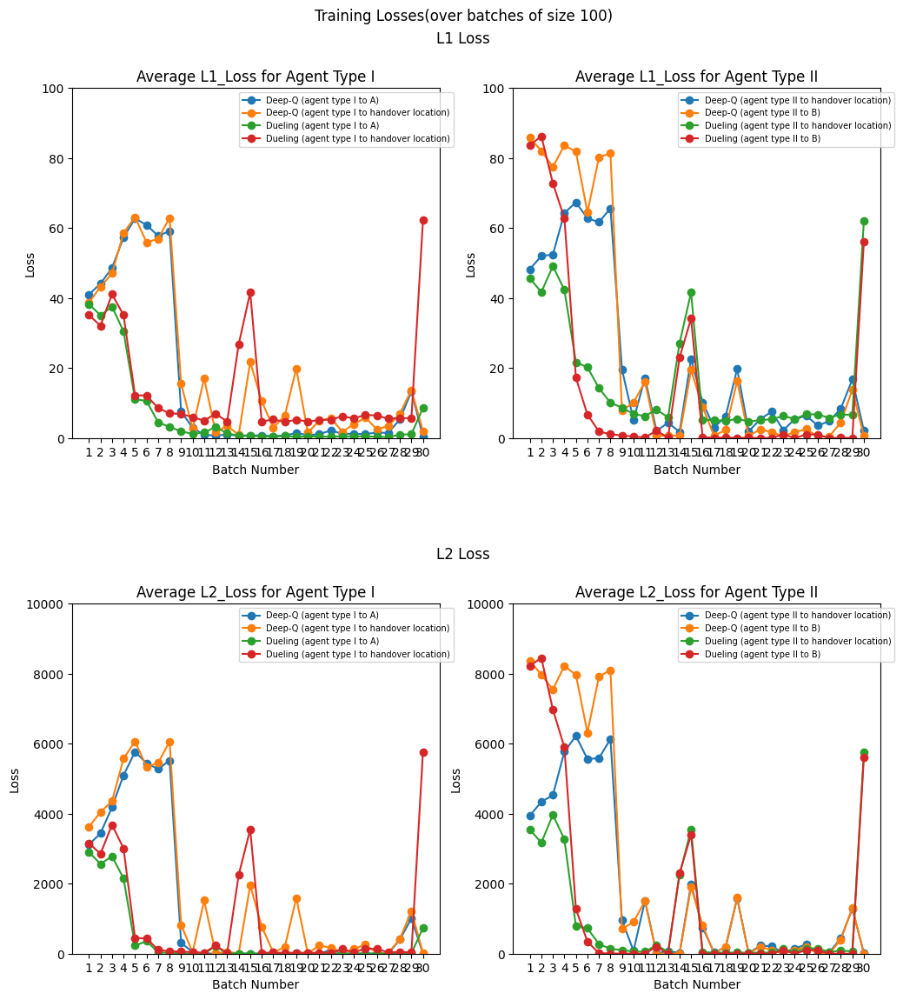
</center>

### **Loss Graphs (Evaluation)**

To visualize the performance of our model over time, we plot the losses over the number of episodes as a line graph. 
Note: these are the custom L1 and L2 losses (NOT the SmoothL1Loss used for training the Deep Q-Network) which directly assesses model performance in reaching the target via the least number of steps

Note: the spikes in losses are due to the moving goalpost when weights of prediction network is copied over to target network, importantly you can see that the spikes in losses decrease as training progresses and eventually loss converges to 0, which proves that our model is learning

We note that although the original Deep-Q method had higher average losses in earlier batches, after its loss decreased to 0, regardless of moving goalpost, no more loss spikes were seen showing that it converged stably. On the other hand, Dueling method had lower average losses in the beginning but experienced larger spikes later on showing instability for this particular hyperparameter configuration.

<center>
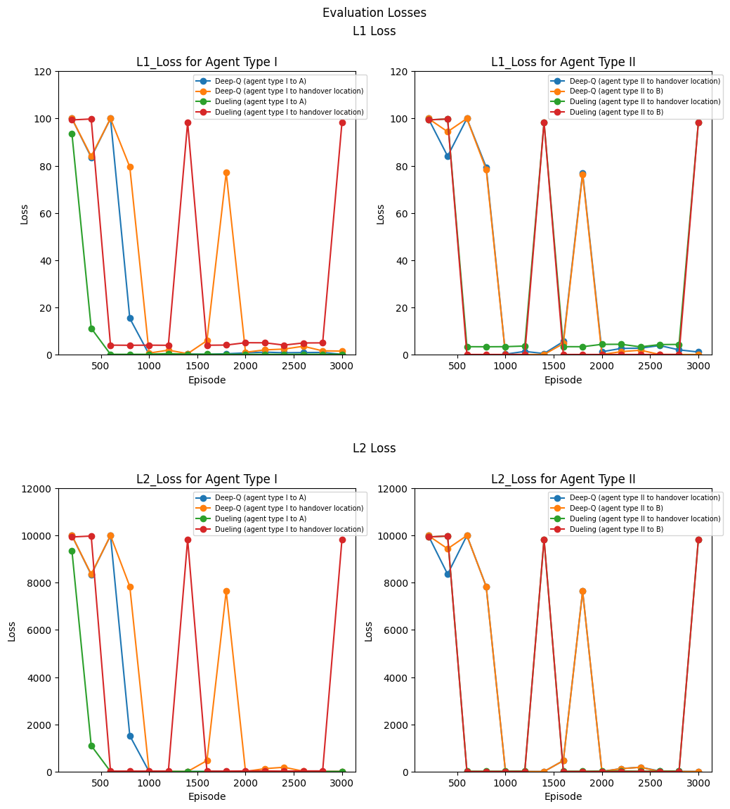
</center>

## Grid Size Testing

To show that our solution is adaptable to different sized grid worlds, below we have trained a separate model for the following grid world sizes:

### (3x3)

<p style="text-align:center;">
    Random Agent Path at Episode 1 for 3x3 World (greedy policy)&nbsp;&nbsp;
    <span style="float:center;">
        Random Agent Path at Episode 2400 for 3x3 World (greedy policy)
    </span>
</p>

<center>
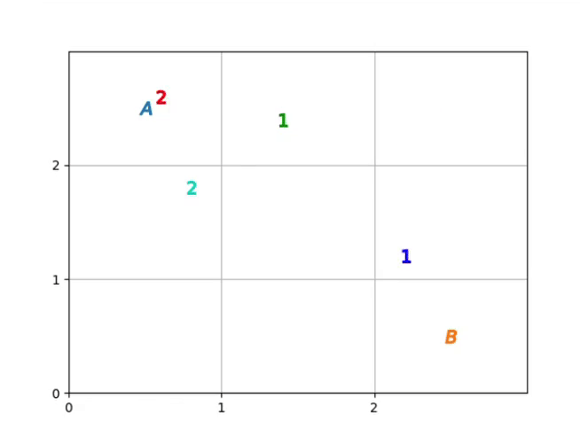

</center>

### (6x6)

<p style="text-align:center;">
    Random Agent Path at Episode 1 for 6x6 World (following greedy policy)&nbsp;&nbsp;
    <span style="float:center;">
        Random Agent Path at Episode 2800 for 6x6 World (following greedy policy)
    </span>
</p>

<center>
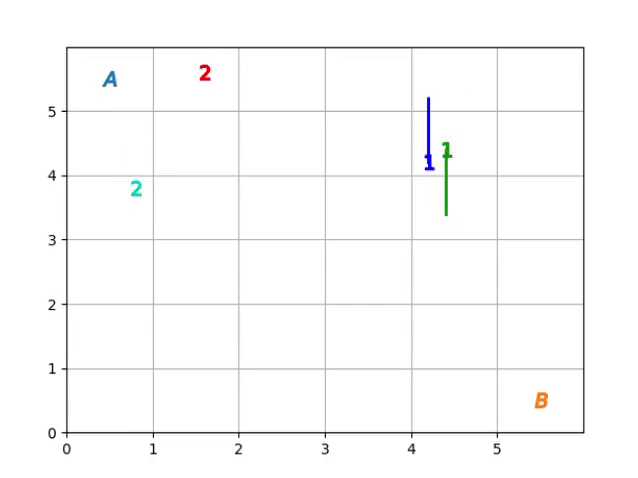
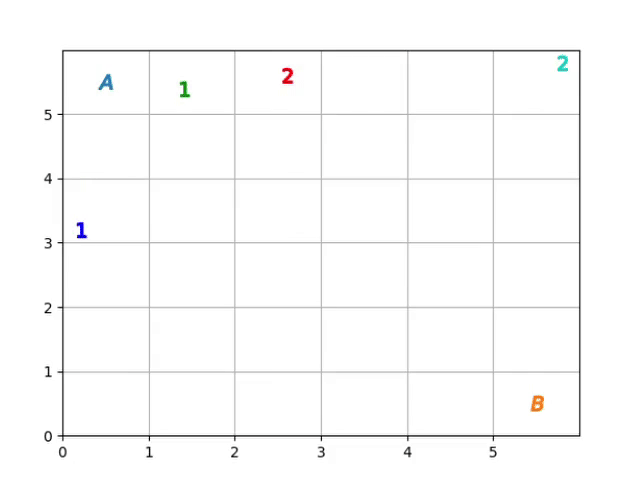
</center>